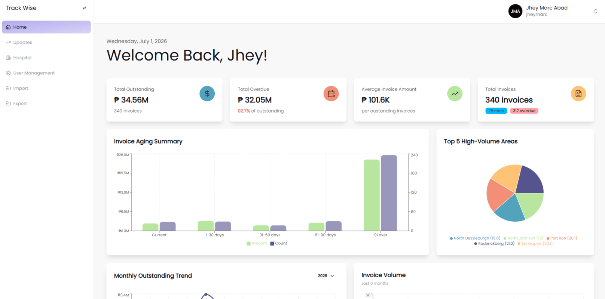

# Track Wise

A hospital invoice tracking and management system built for a medical supply company, designed to help employees manage and monitor invoices efficiently.

## Preview

## About

Track Wise is a hospital invoice tracking and management system built for Progressive Medical Corporation, a medical supply company. Before Track Wise, employees tracked invoices manually using spreadsheets — a process that was slow and prone to errors as the company grew.

Track Wise replaces that process with a centralized system for managing and monitoring invoices, and is actively used by the company's employees today.

Built with Laravel and React (via Inertia.js), it was developed as a real, production-level solution to an operational need — not just a practice project.

## Features

- Bulk import of outstanding invoices via Excel, including areas, hospitals, and invoice data
- Manual CRUD for managing hospitals and invoices, with full invoice history tracking
- Search and filtering across all data views
- Export invoices as PDF files
- Analytics dashboard with key metrics:
  - Total Outstanding & Total Overdue
  - Average Invoice Amount & Total Invoices
  - Invoice Aging Summary
  - Top 5 High-Volume Areas
  - Monthly Outstanding Trend & Invoice Volume
  - Top 10 Hospitals by Outstanding Amount
- Role-based permission system with 13 granular permissions, allowing admins to assign access based on each employee's responsibilities